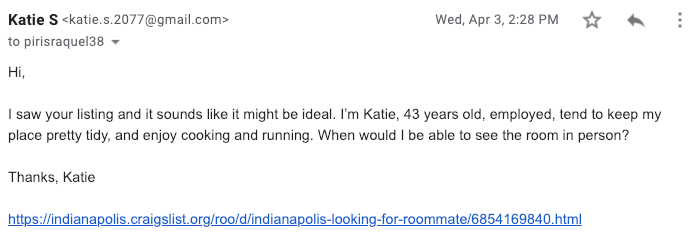

```{r setup, include=FALSE}
knitr::opts_chunk$set(echo = TRUE)
```

```{r libraries, message=FALSE, warning=FALSE, include=FALSE}
library(data.table)
library(stargazer)
library(pwr)
library(sandwich)
library(lmtest)
library(ggplot2)
library(gridExtra)
library(dplyr)
library(car)
```

# Introduction

In a recent study, Zillow found that the share of adults living with a non-spouse, non-partnered roommate increased from 21% in 2005 to 30% at the end of 2017^[1]^. Whether it is due to changing attitudes about living with roommates, a necessity due to increased rents in major cities, or some other factor, the trend is clear: more Americans are cohabitating with someone other than a spouse or partner. While college and post-college aged urbanites often expect to have roommates, the trend is increasing for those older than 30, as a recent New York Times profile depicts^[2]^. As employment opportunities continue to cluster in dense metropolitan areas such as New York and San Francisco, an older cohort may be forced to cohabitate in order to pursue economic opportunity.

In spite of this demographic trend, little research has been done into whether the age of someone looking for a place to live with roommates has an impact on their options. As the New York Times profile describes, until recently the idea of having a roommate was mostly relegated to young professionals in their 20s^[2]^.  Furthermore, in the United States it is not illegal to discriminate on the basis of age for roommates and other housing related decisions^[3]^.  If age presents itself as a barrier to finding a roommate or living situation, this could add an additional obstacle to those beyond "typical" roommate age wishing to move to a dense metropolitan area to pursue employment, impacting economic opportunity for this age cohort.  With this implication, our study sought to examine the existence of possible age bias in responses to roommate inquiries.

# Research Question

Through this experiment, we set out to determine if post-college-age professionals face an age penalty when seeking a roommate. We investigate whether age affects the probability of receiving a "favorable reply" when responding to a roommate request posting on Craigslist. We hypothesized that older ages would generally receive fewer favorable replies than those shortly past typical college-age (mid-20's).

We define favorable replies as those that are 1) received within 72 hours of sending our email and 2) asking for more information or requesting next steps. An unfavorable reply is any other reply received within 72 hours. If a response is not received within 72 hours it is considered no reply.

# Initial Experiment Idea

Our initial experiment sought to test both gender and age discrimination as well as their interaction. We created two email accounts for a female (age 27 and 43) and two email accounts for a male (age 27 and 43). We chose these ages to avoid round numbers, have the younger persona sufficiently past typical college-age, and have the older person over 40. We wanted the two treatment ages to be sufficiently different as to measure a material difference without pushing the extremes of old or young to still reasonably represent a large portion of roommate seekers.

We also considered running this experiment in several different cities in the U.S. to see if regional differences exist in terms of gender and age.

A pilot was conducted in early March to determine if our initial approach would work and identify potential obstacles. We discovered issues with Craigslist and Gmail fraud mechanisms that led us to modify our approach. See Pilot Study below for further details. 

## Pilot Study and Outcomes

We conducted a pilot study for three days to identify any problems that may surface during the full study. Major learnings from the pilot:

1) VPNs are difficult to use with Craigslist. We initially wanted to use a VPN to avoid being flagged as fraud by Craigslist. We tried several popular VPNs but Craigslist blocked all the associated IP addresses from sending emails.

2) Google sent one of our accounts a notification that it was shutting down one of our accounts because it detected the account was not being used according to Google's guidelines. 

We did not want to send email on behalf of multiple personas from the same IP address for fear of fraud detection. Given this preference and the additional learnings from the pilot study, we concluded that maintaining too many personas would be difficult and decided to limit our full study to 2 personas. We were able to each imitate two separate individuals by using separate devices and/or a different internet connection such as a mobile hotspots. We anticipated that response rates could be low and thought females might have higher response rates, so we elected to use two female personas. In the pilot study, more postings seemed to be open to females, and we speculated that males would be more willing to live with females than females would be willing to live with males.

Not all posts seemed appropriate for measuring effects on a typical applicant. The following types of posts were excluded:

  a) Posts with sexual implications including "friends with benefits" or reduced rent in exchange for sex 
  b) Posts soliciting other favors in exchange for reduced rent such as babysitting
  c) Posts for students only (as we were targeting a conclusion for working professionals)
  d) Posts without an email option or posts explicitly stating that email replies will not be answered
  e) Posts explicitly stating males only

# Experiment Design & Methodology

The experiment design consisted of sending emails to listings under the Craigslist heading "Housing" > "Rooms/Shared". 

In order to be able to draw conclusions with the best chance of generalizing to the US population, Indianapolis was selected as the target market. Indianapolis is a mid-sized city located in the midwest with demographics similar to the United States as a whole.

We sent emails every 1-3 days across a two-week time period. We were not particularly concerned with the exact times or days we collected data since we were collecting a number of time-based covariates in order to model any temporal effects. We did make a conscious effort to cover a broad range of variation in our temporal covariates by sending emails on every day of the week and including a mix of morning, afternoon, and evening collections.

The following procedure was implemented each time emails were sent:

1) Open all postings since the last data collection (or fewer if subject to time constraints, prioritizing recent postings)
2) Go through each post and throw out any that meet our exclusion criteria
3) Obtain a count of the number of included (remaining) posts
4) Generate an array of this length, randomly assigning each post to one of our treatment conditions with equal probability
5) Beginning with the first persona in the array, log into their respective email account and begin emailing posters in order from most recent to least, recording covariates as we go

Emails were sent only to listings that were new, or listings that had been posted days or weeks ago but were "refreshed" in the postings list. The data was collected manually in a spreadsheet. See the Data section for all variables collected.

Only responses received within 72 hours were flagged as a legitimate reply. We chose 72 hours as an appropriate window of time to account for people on vacation, a family emergency, or work-related event prevent them from responding within 24 hours. If a response to our treatment arrived after 72 hours, the response was considered a "no reply".

Below is an example of the email template.

\vspace{2mm}



## ROXO Grammar

Treatment was applied at various times since our data was collected over several weeks. We did not always have observations on the previous cohort (group of 10-20 emails sent) prior to treating a new cohort due to our imposed 72 hour waiting period. This was not a concern as we believed there to be little chance posters would interact with each other.

We demonstrate these characteristics using ROXO grammar in the following diagram. Each cohort is randomized, treated, and, sometime over the next 72 hours, observed.

\vspace{3mm}
```{r echo=FALSE, fig.height=2, fig.width=3.5}
horiz_space = .2
diagram = data.frame("Time" = c(1,1,1+horiz_space,1+horiz_space,1+2*horiz_space,1+2*horiz_space),
                     #"y"=c(6,5,4,,1+vert_space,1),
                     "y" = seq(from=6, to=1.25, by=-.95),
                     "text"=rep(c("R X1      O","R X2      O"),3))
ggplot(diagram, aes(Time, y, label=text)) +
  geom_text(size=6) + 
  xlim(c(.8,2)) + 
  ylim(c(.6,6.2)) +
  theme(#axis.line=element_blank(),
        axis.text.x=element_blank(),
        axis.text.y=element_blank(),
        axis.ticks=element_blank(),
        #axis.title.x=element_blank(),
        axis.title.y=element_blank(),
        legend.position="none",
        panel.background=element_blank(),
        #panel.border=element_blank(),
        #panel.grid.major=element_blank(),
        panel.grid.minor=element_blank(),
        plot.background=element_blank()) +
  geom_segment(aes(x = .8, y = .6, xend = 2, yend = .6),
               arrow = arrow(length = unit(0.08, "npc")))
```

# Data

## Data Types

```{r include=FALSE}
#df = read.csv("Data_Collection_Sheet.csv", fileEncoding="UTF-8-BOM")
d <- read.csv("craigslist.csv", stringsAsFactors = FALSE)
d$email_sent_date = NULL
d$email_sent_time = NULL
d$post_date = NULL
d$post_time = NULL
d$reply_date = NULL
d$reply_time = NULL
```

The following variables were collected: spanning posting metadata, contents (for archiving purposes), time information (for temporal effects), covariates, and treatment applied. As we were not sure how clean our data would be and what would prove useful, we erred on the side of collecting more variables than would likely be needed.

```{r, include=FALSE}
sum(is.na(d$poster_age))/nrow(d)
sum(is.na(d$poster_gender))/nrow(d)
sum(is.na(d$list_type))/nrow(d)
sum(is.na(d$list_price))/nrow(d)
```

| Variable             | Description                       | Example                                    | % Missing |
|----------------------|-----------------------------------|--------------------------------------------|-----------|
| Post Title           | Title of the Craigslist post      | Roommate/shared house ASAP                 | 0%        |
|----------------------|-----------------------------------|--------------------------------------------|-----------|
| Post Body            | Body of the Craigslist post       | ALL INCLUSIVE 10 minutes from downtown...  | 0%        |
|----------------------|-----------------------------------|--------------------------------------------|-----------|
| Post URL             | URL of the Craigslist post        | https://indianapolis.craigslist.org...     | 0%        |
|----------------------|-----------------------------------|--------------------------------------------|-----------|
| Poster Age           | Age of the resident who posted    | 34                                         | 81%       |
|----------------------|-----------------------------------|--------------------------------------------|-----------|
| Poster Gender        | Gender of the resident who posted | Female                                     | 64%       |
|----------------------|-----------------------------------|--------------------------------------------|-----------|
| Listing Type         | Type of residence                 | Apartment                                  | 8%        |
|----------------------|-----------------------------------|--------------------------------------------|-----------|
| Listing Price        | Price of the listing              | 450                                        | 0%        |
|----------------------|-----------------------------------|--------------------------------------------|-----------|
| Posting Timestamp    | Timestamp that the post went up   | 3/21/2019 22:38                            | 0%        |
|----------------------|-----------------------------------|--------------------------------------------|-----------|
| Email Sent Timestamp | Timestamp that we emailed         | 3/22/2019 6:59                             | 0%        |
|----------------------|-----------------------------------|--------------------------------------------|-----------|
| Treatment            | Which alias we emailed from       | Katie 27                                   | 0%        |
|----------------------|-----------------------------------|--------------------------------------------|-----------|
| Reply                | Did we receive a reply?           | Y                                          | 0%        |
|----------------------|-----------------------------------|--------------------------------------------|-----------|
| Favorable Reply      | Did we receive a favorable reply? | Y                                          | 0%        |
|----------------------|-----------------------------------|--------------------------------------------|-----------|
| Reply Timestamp      | Timestamp of a reply, if received | 3/23/2019 16:53                            | 0%        |
|----------------------|-----------------------------------|--------------------------------------------|-----------|
| Weekend              | Was our email sent on a weekend?  | Y                                          | 0%        |

In total, we sent `r nrow(d)` emails - `r sum(d$treatment=="katie_27")` for "Katie 27"" and `r sum(d$treatment=="katie_43")` for "Katie 43". Several variables were missing a significant portion of data and were not used in our models. In particular, we had hoped the variables 'poster age' and 'gender' could hold predictive value and reduce the standard error on our treatment effect. Our hypothesis was be that all else being equal, people prefer to live with those of the same gender and/or age. However, gender and age were each missing in over 50% of posts, so we excluded them from any analysis.

Since some replies we received did contain further information on the poster, which sometimes included a name, age, or gender, we considered filling in some missing data from replies where possible. We eventually decided against this for a few reasons. First, we still would not get close to 100% completeness on those variables and would need a separate category for "Unknown". Introducing imputations from responses might even need to be modeled as a separate category distinct from the same information as obtained directly from the post. We also believe that getting more complete covariate data from _the types of people who reply to our emails_ would distort the relationship between that covariate and probability of a reply. This could bias the effect of the covariate and in turn bias our estimate of the treatment effect. Finally, since this information is not readily available to someone browsing Craigslist, it is of limited use to them because by the time they receive it, they already have their reply.

After examining our logged data, we looked for duplicate URLs to ensure that we hadn't accidentally emailed the same poster more than once. This could have made the poster suspicious of our behavior, especially if we sent them otherwise identical emails with two different ages, but even in the event that we sent the same email twice. We did find four postings for which we had sent emails from both "Katie 27" and "Katie 43", a total of eight observations in our dataset.  While a few of these emails garnered replies -- in some cases for both "Katies" -- we removed all eight records from our dataset as we could not assess any possible spillover that may have occurred. We briefly considered only throwing out the second email and keeping the first in the event that we had already received a response to our first email before sending our second. We decided against this as we did not want to selectively throwing out data on the types of people who did not respond quickly and favorably. The effect would have on average been balanced between our two treatments, but it would have biased our point estimates of response rates. Given our randomization scheme, we believe we can throw out all instances of duplicated subjects indiscriminately without imposing any bias into our experiment.

## Data Transformations

```{r include=FALSE, message=FALSE}
# Timestamps
d$sent_timestamp <- as.POSIXct(d$sent_timestamp,format="%m/%d/%Y %H:%M", tz="EST")
d$post_timestamp <- as.POSIXct(d$post_timestamp,format="%m/%d/%Y %H:%M", tz="EST")
d$reply_timestamp <- as.POSIXct(d$reply_timestamp,format="%m/%d/%Y %H:%M", tz="EST")

# Timestamp distances
d$hours_post_to_email <- as.numeric(difftime(d$sent_timestamp,d$post_timestamp, units="hours"))
d$hours_email_to_reply <- as.numeric(difftime(d$reply_timestamp,d$sent_timestamp, units="hours")) # Note - not used will remove

# Age
d$poster_age = as.numeric(d$poster_age)

# Combine list_types
d <- within(d, list_type[list_type == 'townhouse'] <- 'house')
d <- within(d, list_type[list_type == 'condo'] <- 'apartment')
d$list_type[is.na(d$list_type)] <- 'unknown'
d$list_type = as.factor(d$list_type)

# Create weekend variable
d$sent_is_weekend <- ifelse(d$email_sent_dow %in% c(1,6,7), 1, 0)

# Binarize outcome
d <- within(d, {
  fave_reply = ifelse(fave_reply == "Y", 1, 0)
})
```

We noticed a right-skew tendency in our continuous variables. This is suggestive that multiplicative differences are more meaningful than additive differences. Given this observation we decided to perform log transformations to facilitate this interpretation. It also may aid our modeling because a lopsided clustering of data points at one end of the range of possible values could reduce the quality of our fit at the other end. This will to some extent even out the distribution of values at either end.

```{r EDA, echo=FALSE, fig.height=4.5, fig.width=7, message=FALSE}
h.1 <- ggplot(d, aes(x=list_price)) + geom_histogram(binwidth=100) + 
  xlab("List Price") + ylab("Count")
h.2 <- ggplot(d, aes(x=log(list_price))) + geom_histogram(binwidth=.15) + 
  xlab("Log of List Price") + ylab("Count")
h.3 <- ggplot(d, aes(x=hours_post_to_email)) + geom_histogram(binwidth=72) + 
  xlab("Hours Between Post & Email") + ylab("Count")
h.4 <- ggplot(d, aes(x=log(hours_post_to_email))) + geom_histogram(binwidth=1) + 
  xlab("Log of Hours Between Post & Email") + ylab("Count")
grid.arrange(h.1, h.2, h.3, h.4, nrow=2,
             top="Right-skewness and Effects of Log Transformations")
```

# Results

## Summary Results

The figure below shows the average rate of favorable replies by treatment specification:

```{r echo=FALSE, fig.height=4, fig.width=5}
# Calculates mean, sd, se and IC
my_sum <- d %>%
  group_by(treatment) %>%
  summarise( 
    n=n(),
    mean=mean(fave_reply),
    sd=sd(fave_reply)
  ) %>%
  mutate( se=sd/sqrt(n))  %>%
  mutate( ic=se * qt((1-0.05)/2 + .5, n-1))
ggplot(my_sum) +
  geom_bar( aes(x=treatment, y=mean), stat="identity", fill="darkgrey", alpha=0.5) +
  geom_errorbar( aes(x=treatment, ymin=mean-ic, ymax=mean+ic), width=0.4, colour="black", alpha=0.9, size=1) +
  ggtitle("Favorable Reply Rate by Treatment Specification") + xlab("Treatment Specification") + ylab("Average Favorable Reply Rate")
```

As you can see, "Katie 27" had a slightly higher rate of favorable replies, however both rates are well within each others' margins of error.  This is examined in greater detail in the regression section.

## Regression

To estimate our treatment effects, we employed a variety of regression specifications.  All of the regression specifications began with the following format:

$$Y = \beta_0 + \beta_1(Treatment) + \epsilon$$
For regressions with additional covariates, the specification included additional beta coefficients for each covariate.

$$Y = \beta_0 + \beta_1(Treatment) + \epsilon + \beta_2(Covariate_1) + ... + \beta_{n+1}(Covariate_n) + \epsilon$$

We used linear regression for each of our four regression models, regressing the binary variable of a favorable reply on our treatment and, for the final three models, our chosen covariates. While our outcome variable is binary, using a linear regression allows us to directly measure the expected change in probability of getting a favorable reply, with the coefficients of the independent variables corresponding to the probability increase or decrease.

The first regression contains only the treatment variable.

The second regression contains treatment and the log of hours between post time and the email being sent. We will detail this in the next section, but we wanted to ensure the only statistically significant covariate had no impact on the treatment effect.

The third regression contains the treatment variable, the log of hours between post time and the email sent, and the binary indicator of the email being sent on the weekend. This regression specification is meant to help ensure that we randomized effectively and that variables related to the listing type were not correlated with the treatment.

Finally, the fourth regression regresses favorable reply on the treatment, the log of list price, binary indicators for house and unknown list types (leaving apartments as the base case), the log of hours between the post time and email sent, and a binary value indicating if the treatment or control email was sent on a weekend. Given that we have only 113 observations, we were wary of including all of our variables for fear of overfitting our regressions and to preserve degrees of freedom. A number of our variables were sparsely populated, so we selected these variables based on their near-complete observations as well as likelihood of explaining variations in a poster's response.

```{r message=FALSE, include=FALSE}
# model 1: exhaustive regression
model.1 = lm(fave_reply ~ treatment+log(list_price)+list_type+log(hours_post_to_email)+sent_is_weekend, data=d)
model.1.robust <-coeftest(model.1, vcov = vcovHC(model.1, type="HC"))
#model.1.robust
cov1 <- vcovHC(model.1, type = "HC")
robust.se.1 <- sqrt(diag(cov1))

# model 2: removing list type and price (rationale - maybe correlated with weekend sent)
model.2 = lm(fave_reply ~ treatment+log(hours_post_to_email)+sent_is_weekend, data=d)
model.2.robust <-coeftest(model.2, vcov = vcovHC(model.2, type="HC"))
#model.2.robust
cov2 <- vcovHC(model.2, type = "HC")
robust.se.2 <- sqrt(diag(cov2))

# model 3: only treatment and hours_post_to_email (the only significant covariate)
model.3 = lm(fave_reply ~ treatment+log(hours_post_to_email), data=d)
model.3.robust <- coeftest(model.3, vcov = vcovHC(model.3, type="HC"))
#model.3.robust
cov3 <- vcovHC(model.3, type = "HC")
robust.se.3 <- sqrt(diag(cov3))

# model 4: treatment only
model.4 = lm(fave_reply ~ treatment, data=d)
model.4.robust <- coeftest(model.4, vcov = vcovHC(model.4, type="HC"))
#model.4.robust
cov4 <- vcovHC(model.4, type = "HC")
robust.se.4 <- sqrt(diag(cov4))

plot(model.1)
#plot(model.2)
#plot(model.3)
#plot(model.4)
```

``` {r stargazer, results='asis', echo=FALSE, fig.pos="H"}
stargazer(model.4, model.3, model.2, model.1,
          se=list(robust.se.4, robust.se.3, robust.se.2, robust.se.1),
          float=TRUE, float.env="sidewaystable",
          header=FALSE)
```

Examining the results of the four regression specifications, we see a fairly consistent treatment effect ranging from `r round(model.1.robust['treatmentkatie_43','Estimate'], 2)` to `r round(model.4.robust['treatmentkatie_43','Estimate'], 2)`. This suggests that our randomization worked appropriately, and that the measured effect of being a 43 year old female as opposed to a 27 year old females was to reduce the probability of receiving a response to roommate listing inquiries by `r abs(round(model.4.robust['treatmentkatie_43','Estimate'], 2))` to `r abs(round(model.1.robust['treatmentkatie_43','Estimate'], 2))`.  In spite of this practical significance, however, this result lacked statistical significance for all four model specifications with p-values ranging from `r round(model.1.robust['treatmentkatie_43','Pr(>|t|)'], 2)` to `r round(model.4.robust['treatmentkatie_43','Pr(>|t|)'], 2)`.  Therefore, our effect was statistically indistinguishable from zero.  While, as we state in the next section, we did not find evidence of heteroskedasticity, we report heteroskedasticity-robust standard errors in an abundance of caution.

Further examining the results of our models, the only variable to show any statistical significance in our model specifications is the log of hours between the post time and the sending of our treatment or control email. The coefficient of roughly `r round(model.1.robust['log(hours_post_to_email)','Estimate'], 2)` suggests that a 100% increase in response time corresponds with roughly a `r round(log(2) * model.1.robust['log(hours_post_to_email)','Estimate'], 2)*100`% change in likelihood of a response. However, we should also be careful not to place too much weight in the significance of a covariate. Since hours from post to initial email was not the variable we experimented on, it is possible that it is being confounded by unmeasured variables.

### OLS Assumptions

It's important to call out any OLS assumptions that may have been violated. We addressed our decision to use linear regression with a binary outcome above, and we can confirm that random sampling occurred. Through exploratory data analysis, we observed some multi-collinearity across date/time covariates, but only one covariate was chosen such that the models did not contain collinear independent variables.

The Residuals vs Fitted plot shows a slight trend. This isn't extremely surprising given that we are fitting a binary outcome and know that there is some nonlinearity present. We will be cautious with our inference from regression and will make sure it agrees with our other analysis methods. The homoskedasticity assumption appears to hold although it is a little hard to determine again due to the nonlinearity. We used heteroskedasticity-robust standard errors for our inference in an abundance of caution.

```{r include=FALSE}
dw_p = durbinWatsonTest(model.1)[['p']]
```

While we do not strictly qualify as panel data because each cohort represents entirely new subjects, we do have a time component to our data. It is possible that the market has hot and cold trends and response rates could be correlated with previous response rates, so just to be safe, we will test for autocorrelation. We ran a Durbin-Watson Test, which gave a p-value of `r round(dw_p,2)`, suggesting there is no autocorrelation in our model.

Several covariates, such as "housing type" and "date/time" are not linear. And as seen in the Normal Q-Q plot, most of the values do not fit the dotted line violating the Normality of Residuals requirement. This is further reason to be cautious and compare our results with other methods of analysis.

```{r message=FALSE, echo=FALSE}
par(mfrow=c(2,2))
plot(model.1)
```


## Power Calculations

To better understand if and how our experiment might be lacking in power, we ran a 2-Sample Z-test and Power Tests. The Z-test indicates any differences in the proportions between Katie_27 and Katie_43 receiving a favorable reply. Z-test results:

```{r include=FALSE}

# fave_27 <- d[ which(d$fave_reply==1 & d$treatment=='katie_27'), ]
# sum(fave_27$fave_reply) #total = 33
# 
# fave_43 <- d[ which(d$fave_reply==1 & d$treatment=='katie_43'), ]
# sum(fave_43$fave_reply) #total = 29

res <- prop.test(x = c(33, 29), n = c(59, 54))
res
```

**Estimated probability of success:**

            Katie_27    0.559
            Katie_43    0.537
            
**P-value:**  $0.961$

**Confidence Interval at 95%:**  $(-0.179, 0.224)$

\vspace{2mm}
The high p-value of $0.96$, combined with a confidence interval wide enough to have both estimates of the probability of success overlap, leads to a conclusion that the proportion of favorable replies between the two Katies' is not significantly different.

```{r include=FALSE}
power_p <- pwr.t.test(d=0.022, sig.level = 0.05, n=113)
```

In fact, running a simple power test reveals a power of only `r round(power_p$power,2)`, suggesting the probability of finding an effect given that there truly was one was only `r round(power_p$power,2)`. To identify what would have been necessary to detect a statistically significant effect, we then ran two power tests, one to calculate the number of observations we would need to obtain for *each* treatment given this effect size, the other to determine the required difference between the outcome variable (favorable replies) in order to observe a statistically significant effect from only 113 observations.

```{r include=FALSE}
power_n <- pwr.t.test(d=0.022, sig.level=0.05, power=.8)
power_n
power_n_num = power_n['n']
power_d <- pwr.t.test(n=113, sig.level=0.05, power=.8)
power_d
power_d_eff = power_d['d']
```

We would need `r format(as.integer(power_n_num), scientific=FALSE)` subjects per treatment condition for our results to be statistically significant. In order to be able to observe a statistically significant effect in age on the outcome variable "favorable replies" using only `r nrow(d)` observations, the treatment effect would need to be `r round(as.numeric(power_d_eff),2)`, approximately 10-15 times our observed effect size, depending on the regression specification used. We anticipated a much larger effect size, which contributed to our lack of power in this experiment. 

Power increases as sample size or effect size go up, and/or standard deviation is reduced. Because of the requirement of over $32,000$ observations needed for each treatment, in addition to being unsure the treatment effect would be as high as $37\%$ , we conclude that for this particular research project, we do not find any meaningful difference in the rate of favorable replies based on age.

## Randomization Inference

```{r include=FALSE}
d_dt <- data.table(d)

reply_treatment <- d_dt[treatment=="katie_43", mean(fave_reply==1)]
reply_base <- d_dt[treatment=="katie_27", mean(fave_reply==1)]
ate <- reply_treatment - reply_base
```

```{r include=FALSE}
iter <- 10000
ate_vec <- rep(NA, length(iter))
for(i in 1:iter){
d_dt[, success_rand := sample(c(0,1), size = .N, replace=TRUE)]
ate_vec[i] <- as.numeric(d_dt[ , .('success_mean' = mean(fave_reply==1)), keyby =.(success_rand)][ , .('ate' = diff(success_mean, lag=1, differences=1))])
}
```

```{r include=FALSE}
ri <- table(ate_vec<ate)
```

In addition, we also used randomization inference to examine the probability of calculating our treatment effect by chance. Randomization inference has the advantage of being a non-parametric method and as a result doesn't rely on large sample sizes or central limit theorem assumptions. Examining the difference in means, we calculate an average treatment effect of `r round(ate,4)`.  Running randomization inference with `r iter` iterations, we find `r as.numeric(ri[2])` random iterations with at least as significant a treatment effect as our actual.  This implies a p-value of `r as.numeric(ri[2]) / as.numeric(iter)`, a non-statistically significant result.  This is consistent with our linear regression results showing a non-statistically significant treatment effect and is roughly on the same order of magnitude as our p-values from regression and our z-test. We chose `r iter` iterations because repeated trials showed similar p-values and suggested our result was converging well.

## Causal Mechanism

If an effect existed, it could have been driven by a multitude of factors. Had we been able to capture age and gender of every poster, we may have seen a "birds of a feather flock together" pattern.

In hindsight, there may be confounding factors contributing to the effect such as demographics in Indianapolis, supply and demand of housing, and the unemployment rate (to name a few.)

When it comes to experiments of this nature, there are often unmeasurable factors that come in to play such as the lifestyle of the person looking for a roommate, unconscious bias toward dissimilar age groups, as well unconscious gender bias. Stereotypes such as "men are messier than women" exist as human perception and sometimes partial truths.

# Improvement Opportunities

Moving forward, an experiment executed using a similar methodology would require rigorous preparation. Considerations such the population demographics of the area of study, unemployment rates, renting/roommate trends, supply/demand of rental units would all have an impact on the outcome. 

In addition, the manual collection of data is tedious at best, and often leaves room for error that can be difficult to find. Because of this, a more controlled experiment is recommended.

A controlled experiment could leverage an online platform that starts by providing a description of an apartment or house to participants. Participants will be informed that they have placed this ad on a free website and that they are looking for a roommate. (The roommate would pay their equal share, etc.) Participants would then be asked to review email inquiries from potential renters and indicate how likely they (the participant) would be to respond to the email. Email inquiries would be virtually identical with the exception of age.

This manner of execution would also allow for blocking by participant gender and clustering by participant age. With a large enough, randomly selected participant group, other variables such as renter gender could also be tested.

Although specifics would need to be flushed out in greater detail, this type of execution would provide a "contained" environment, potentially reduce the amount of confounding variables, and allow researchers to avoid manual data collection.

# Conclusions

Based on the outputs of the regression analyses, we are unable to draw conclusions from this experiment. Although an impact between `r round(model.1.robust['treatmentkatie_43','Estimate'], 2)` to `r round(model.4.robust['treatmentkatie_43','Estimate'], 2)` was observed, the result lacked statistical significance in all four of the models, as well as in our randomization inference scenario. Even if this result had been found statistically significant, it would have been deemed practically insignificant.

In addition, the Power Tests indicated the need for either a much larger sample size, or a more pronounced effect. Over the course of approximately two weeks of data collection, we identified 113 roommate-wanted listings that conformed to our specifications (noted under Experiment Design). If we were to gather 32K+ observations for each treatment (or 64,000 observations total) in order to draw definitive conclusions (based on the Power Test), it would take 22.7 years of replying to roommate listings in Indianapolis (see math in Appendix). 

This does not suggest that age bias doesn't exist. In the manner with which our experiment was executed, we agree that it is not possible to reach a conclusion and that another method to test for age, such as the design outlined under Improvement Opportunities be explored.


# Appendix

Math calculation for Conclusion:

- 113 new, non-sexual, no 'male only' listings in a two-week period
- 26 two-week-periods per year
- Estimate 2,938 listings per year to receive a "Katie" email
- 64,000 observations needed / 2,938 listings per year = 
**22.7 years of listings**


# References
[1] Bretz, Lauren, _As Rents Rise, More Renters Turn to Doubling Up_(2017), https://www.zillow.com/research/rising-rents-more-roommates-17618/

[2] Pappu, Sridhar, _Age 31 and Up, With Roommates. You Got a Problem With That?_(2016), https://www.nytimes.com/2016/05/06/fashion/mens-style/adult-men-roommates-new-york.html

[3] Department of Justice, _Fair Housing Act_, (https://www.justice.gov/crt/fair-housing-act-1)


